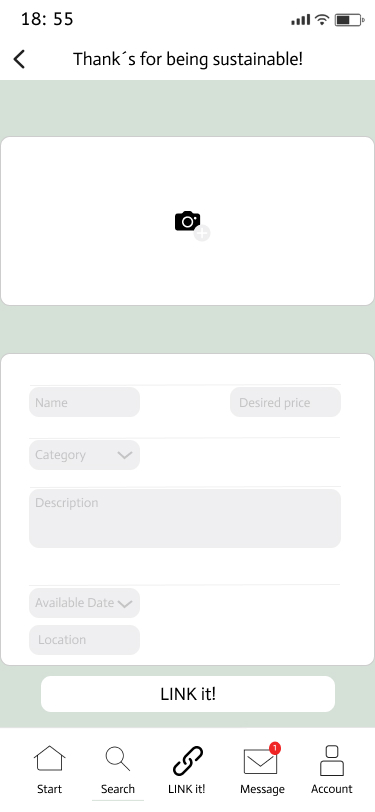

# Produkte Einstellen

Als Verleiher möchte ich meine Produkte einstellen können, um Verleihkunden zu erreichen und Verleihverträge abschließen zu können.

## Akzeptanzkriterien:

Beim Einstellen eines Produkts möchte der Verleiher folgende Daten eingeben:

- Mehrere Bilder pro Produkt hochladen
- Produkttitel
- Produktpreis festlegen pro Tag
- Produktbeschreibung Fließtext eingeben
- Produktzustand (siehe unten)
- Produktkategorie (siehe unten)

### Webansicht:

### Mobileansicht:

### Kategorien für Produktzustand:

- Wie neu
- Sehr gut
- Gut
- Akzeptabel

### Kategorien für die Produktart

- Elektronik
  - Audio & HiFi
  - Foto & Kamera
  - Konsolen
  - PC/Notebook
  - Sonstiges
- Freizeit & Sport
  - Camping
  - Kinder-Spielzeug
  - Sport-Equipment
  - Sonstiges
- Haus & Garten
  - Event-Zubehör
  - Garten-Zubehör
  - Küchen-Zubehör
  - Werkzeug
  - Sonstiges

### Design Tokens

- link-green: #D5E1D7
- light-gray: #EFEFF1
- dark-gray: #CDCDCD
- copy: #1F1F1F
